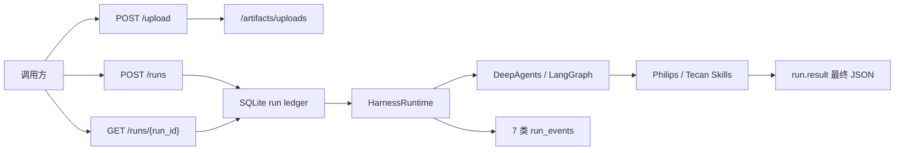

# DsAgents 系统架构

> 本轮刷新：2026-07-22。实现事实见 `backend/.planning/codebase/`；本文只定义系统边界与稳定决策。

## 系统定位

DsAgents 是**单子项目、run-first** 的 Agent 运行时底座：产品代码仅在 `backend/`（发行名 `dsagents`），**无前端子项目**。它接收本轮消息与上传 artifact，驱动可注入的 DeepAgents Brain，将过程投影为可轮询的 run 与固定事件，并将 Philips 外高桥 / Tecan 境外供应链的最终业务 JSON 写入 `run.result`，供 OMS 消费。

## 稳定系统边界

- HTTP 仅四端点：`POST /upload`、`POST /runs`、`GET /runs/{run_id}`、`POST /runs/{run_id}/cancel`。调用方轮询；**无** SSE、session CRUD、下载路由、Webhook 或 OMS 自动保存 API。
- **run-first**：`run` 是唯一执行与查询单位；`run_events` append-only，`runs` 为投影快照。最终业务 JSON 只读 `run.result`，不解析 `reply`、thinking 或工具候选文本。
- `session_id` 只作 LangGraph `thread_id` 与进程内同 session 单飞锁；不承担业务状态、归档或查询接口。
- 三层状态归属清晰、互不替代：
  - run ledger → 对外执行终态与可观测投影
  - LangGraph checkpointer → 短期图上下文
  - LangGraph store → Agent memory（`/memories/`）
- 代码边界固定为 `backend/api.py`、`runtime/`、`integrations/`、`skills/`；历史 setuptools 构建产物（如 `backend/build/`）不是源码。
- 部署假设为**单进程** session 锁与 cancel control；多 worker 无跨进程互斥。

## 子系统职责

| 层 | 路径 | 职责 |
|----|------|------|
| HTTP 适配 | `backend/api.py` | 请求校验、上传、创建 run、后台线程执行、轮询、cancel、usage 计价、OMS best-effort 写点 |
| 运行时 | `backend/runtime/` | Brain 装配、stream→事件投影、middleware、ToolCatalog、三库资源、run ledger、OMS JSONL |
| 集成 | `backend/integrations/` | `/artifacts` 路径、MinerU HTTP、JSON artifact 读写 |
| 业务 Skill | `backend/skills/` | 渠道合同、Philips/Tecan 下划线 Skill 包、主数据 / XLSX / finalizer |
| 本地门禁 | `backend/tests/` | 可执行 assert 脚本（`python -m tests.*`，**非 pytest**） |

依赖单向：`api → runtime → integrations / skills`。Skill 工具可依赖 `integrations.artifacts`，不反向调用 HTTP。`typing.Protocol` **只**用于 `Brain` / `BrainFactory`；工具为 callable + `ToolCatalog`；资源与 ledger 为具体类。

## 渠道供应链业务设计

### 终态合同

- Philips 与 Tecan 的 `header` 各自独立；`items[]` 共用完整 **24** 字段，返回的每一行必须全字段出现，未知为 `null`。
- 外壳固定：`{outcome, data: {header, items}, problems}`。不输出 `shipment`、Excel、候选抽取噪声、审计细节或 OMS 保存结果。
- 数量、金额、重量为无千分位、非科学计数法字符串；日期为 `YYYY-MM-DD`；编号保留原始字符与前导零。
- `success`、`partial_success`、`input_problems` 都是有效业务 outcome。核心票次/商品事实无法确认时使用 `input_problems`，仍返回完整 header、已证实字段与可复核 problems；该 run 仍为 **`succeeded`**。

### 材料与证据

- 两渠道均可接收同票任意组合的 PDF/XLSX，按**内容**识别发票、运单、装箱单、订单/合同与主数据，不按文件名或固定数量猜测。
- PDF 经 MinerU，XLSX 经只读 inspection 转为 JSON artifact。ZIP、DOCX、图片不解析内容，作为待确认问题列出；其它材料足够时继续。
- 单据事实优先；主数据只按唯一明确的非语义标识补齐，不能覆盖本票数量、金额、重量或编号。冲突/舍入歧义转 `input_problems`。
- 发票上传顺序与原始行顺序必须保留；相同 12NC 默认不合并；同票多个发票/运单稳定地以英文逗号连接。
- 业务同票归集在**单一 run** 内完成；不新增跨 run 消息/任务状态表。

## Agent、状态与 middleware 决策

本期**没有**增加业务消息状态、任务状态机或生产业务 SubAgent。

原因：同票材料只需在一次 Agent run 内归集；外部终态已由 ledger 保存，线程上下文已由 checkpointer 保存。再引入子任务候选、跨 run 工作单或额外 state schema 会让同一票事实在多个位置竞争，不能提高 OMS 合同的确定性。

middleware 只保留横切运行时能力：

| 能力 | 方式 | 原因 |
|------|------|------|
| Philips 结构化输出恢复 | class-based `after_model`（`StructuredOutputRecovery`） | 需读同回合消息、更新状态并通过 `jump_to` 重试/结束；`can_jump_to` 必须含 `"end"` |
| Tool 观测 / 无进展检测 / ToolStrategy thinking 兼容 | runtime middleware | 跨业务、跨模型的执行问题 |
| Memory | `MemoryMiddleware`（主 Agent 有 memory 时） | 加载 `/memories/AGENTS.md` |
| Tecan 最终 JSON | 专用 finalizer 工具 | 业务合同校验，不污染普通请求或全局 graph state |

主 Agent 有 memory 时约 **5** 个 middleware；DK/普通 run 使用 `structured_schema=None`，不按 Philips schema 恢复。

## 运行时装配

- `DeepAgentsBrainFactory` 关闭默认 general-purpose subagent，并传递 `subagents=[]`。
- 固定工具 **5** 个：`parse_documents`、`extract_archives`、`lookup_philips_wgq_master_data`、`inspect_supply_chain_workbooks`、`finalize_tecan_overseas_recognition`（静态注册，无自动扫描）。
- HTTP workflow：`WAG` 使用 `ToolStrategy(PhilipsWgqRecognitionResult)` + Recovery，`DK` 使用 Tecan finalizer；workflow 与客户端 `session_id` 互斥（服务端强制新 session）。
- `DK` 只信任 `finalize_tecan_overseas_recognition` ToolMessage → `run.result`，缺 finalizer 终态即失败。
- WAG 用 **denylist** 排除 Tecan finalizer，DK 用 **denylist** 排除 Philips lookup；均保留共享 MinerU / XLSX 工具，**禁止**业务-only allowlist。
- Skill **单目录**：下划线命名的可 import Python 包内同时放 `SKILL.md` / references、schema 与 scripts；新增须同步 `package-data`。Tecan 不携带 Excel 模板或生成器。

## 存储、可观测性与运维

- 三 SQLite 物理分离：`dsagents_runs.db`（ledger）、`dsagents_checkpoints.db`、`dsagents_store.db`；无自动 schema migration。
- 事件固定 **7** 类：`status`、`tool_execution`、`tool_progress`、`thinking`、`text_delta`、`assistant_message`、`model_usage`。大 payload 可外置到 `data/internal/run-events/`。
- OMS JSONL 索引只在 HTTP `create_run` 成功后 best-effort 追加（`backend/log/oms_log.log`），不是 event、无查询接口、不阻塞 run、不含 `run.result`。
- ledger 与 OMS 时间均使用 **UTC+8** 本地 `YYYY-MM-DD HH:MM:SS`。
- 出站：MiniMax（Anthropic 兼容 LLM）、MinerU HTTP、可选 Oracle（Philips 主数据）。Oracle thick mode 依赖 `ORACLE_CLIENT_LIB_DIR`；缺失时优雅降级为 problems/null，不丢弃已证实单据事实。
- 无 HTTP Auth / Webhook；默认假定受信内网部署。

## 理解路径

| 目标 | 阅读顺序 |
|------|----------|
| 系统边界与决策 | 本文 → [INTERFACES.md](INTERFACES.md) → [coding_maps/SYSTEM_MAP.md](coding_maps/SYSTEM_MAP.md) |
| 实现细节 | [backend/.planning/codebase/](backend/.planning/codebase/)（Analysis Date: 2026-07-22） |
| 全局硬约束 | [AGENTS.md](AGENTS.md) → [docs/conventions.md](docs/conventions.md) |
| 渠道业务合同 | [docs/channel-supply-chain-json-prd.md](docs/channel-supply-chain-json-prd.md) |
| 按任务入口 | [docs/reading-order.md](docs/reading-order.md) 或 SYSTEM_MAP §7 |

## 质量门禁

在 `backend/` 使用 `uv sync`，依次运行七个 `python -m tests.*` assert 脚本；真实模型、MinerU、Oracle 与本地样本回归另行 opt-in。改 backend 后：先更新 `backend/.planning/codebase/`，再更新本文、`INTERFACES.md`、`coding_maps/SYSTEM_MAP.md`，最后在仓库根目录执行 `git diff --check`。
