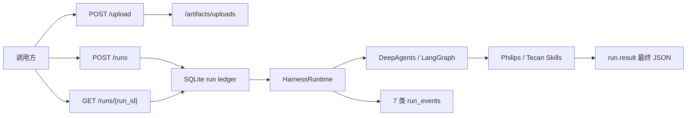

# DsAgents 系统架构

> 本轮刷新：2026-07-22。实现事实见 `backend/.planning/codebase/`；本文只定义系统边界和稳定决策。

## 系统定位

DsAgents 是一个单子项目、run-first 的 Agent runtime。它接收本轮消息和上传 artifact，驱动可注入的 DeepAgents Brain，并将运行过程投影为可轮询的 run 与事件。内置 Philips 外高桥与 Tecan 境外供应链 Skill 都交付干净、可供 OMS 消费的最终 JSON。

## 稳定系统边界

- HTTP 仅四端点：`POST /upload`、`POST /runs`、`GET /runs/{run_id}`、`POST /runs/{run_id}/cancel`。调用方轮询；无 SSE、session CRUD、下载路由或 OMS 自动保存。
- `run` 是唯一执行/查询单位：`run_events` append-only，`runs` 是快照投影；最终业务 JSON 只读 `run.result`，不解析 `reply`、thinking 或工具候选文本。
- `session_id` 只作 LangGraph `thread_id` 和进程内同 session 单飞；不承担业务状态、归档或查询接口。
- LangGraph checkpointer 管短期图上下文，store 管 Agent memory，SQLite run ledger 管对外执行终态。三者分工明确，不新建第二套业务状态表。
- 代码边界固定为 `backend/api.py`、`runtime/`、`integrations/`、`skills/`；无前端子项目。

## 渠道供应链业务设计

### 终态合同

- Philips 与 Tecan 的 `header` 各自独立；`items[]` 共用完整 24 字段，返回的每一行必须全字段出现，未知为 `null`。
- 不输出 `shipment`、Excel、候选抽取噪声、审计细节或 OMS 保存结果。
- 数量、金额、重量为无千分位、非科学计数法字符串；日期为 `YYYY-MM-DD`；编号保留原始字符和前导零。
- `success`、`partial_success`、`input_problems` 都是有效业务 outcome。核心票次/商品事实无法确认时使用 `input_problems`，仍返回完整 header、已证实字段和可复核 problems；该 run 仍为 `succeeded`。

### 材料与证据

- 两渠道均可接收同票任意组合的 PDF/XLSX，按内容识别发票、运单、装箱单、订单/合同和主数据，不按文件名或固定数量猜测。
- PDF 经 MinerU，XLSX 经只读 inspection 转为 JSON artifact。ZIP、DOCX、图片不解析内容，作为待确认问题列出；其它材料足够时继续。
- 单据事实优先；主数据只按唯一明确的非语义标识补齐，不能覆盖本票数量、金额、重量或编号。冲突/舍入歧义转 `input_problems`。
- 发票上传顺序与原始行顺序必须保留；相同 12NC 默认不合并；同票多个发票/运单稳定地以英文逗号连接。

## Agent、状态与 middleware 决策

本期没有增加业务消息状态、任务状态机、Tecan workflow 或 Tecan SubAgent。

原因是同票材料只需在一次 Agent run 内归集；外部终态已经由 ledger 保存，线程上下文已经由 checkpointer 保存。再引入子任务候选、跨 run 工作单或额外 state schema 会让同一票事实在多个位置竞争，不能提高 OMS 合同的确定性。

middleware 只保留横切运行时能力：

| 能力 | 方式 | 原因 |
|---|---|---|
| Philips 结构化输出恢复 | class-based `after_model` | 需要读取同回合消息、更新状态并通过 `jump_to` 重试/结束 |
| Tool 观测 / 无进展检测 / ToolStrategy thinking 兼容 | runtime middleware | 跨业务、跨模型的执行问题 |
| Tecan 最终 JSON | 专用 finalizer tool | 是业务合同校验，不应污染普通请求或全局 graph state |

官方 LangChain middleware 约定中，node-style hook 适合顺序状态检查/更新，wrap hook 适合围绕单次模型/工具调用的重试或变换。本项目的 Philips recovery 选择前者；Tecan 无需 hook，因为最终工具已经是唯一、窄的校验边界。

## 运行时装配

- `DeepAgentsBrainFactory` 关闭默认 general-purpose subagent，并传递 `subagents=[]`。
- 固定工具数为 5：`parse_documents`、`extract_archives`、`lookup_philips_wgq_master_data`、`inspect_supply_chain_workbooks`、`finalize_tecan_overseas_recognition`。
- 唯一 HTTP workflow 是 `philips_wgq_inbound_recognition`，使用 `ToolStrategy(PhilipsWgqRecognitionResult)`。Tecan 由明确的 Skill 请求触发，finalizer ToolMessage 被执行层投影为 `run.result`。
- Philips workflow 用 denylist 排除 Tecan finalizer，保留共享 MinerU/XLSX 检查与 Philips 主数据工具；禁止业务-only allowlist。

## 存储、可观测性与运维

- 三 SQLite 数据库分离：run ledger、checkpoints、store；新 schema 不做自动迁移。
- 事件固定 7 类：`status`、`tool_execution`、`tool_progress`、`thinking`、`text_delta`、`assistant_message`、`model_usage`。
- OMS JSONL 索引只在 HTTP run 创建成功后 best-effort 追加，不是 event、无查询接口、不阻塞 run。
- ledger 与 OMS 时间均使用 UTC+8 本地 `YYYY-MM-DD HH:MM:SS`。
- Oracle thick mode 需要 `ORACLE_CLIENT_LIB_DIR`；缺失时 Philips 主数据补齐优雅降级，不应丢弃已证实单据事实。

## 质量门禁

在 `backend/` 使用 `uv sync`，依次运行七个 `python -m tests.*` assert 脚本；真实模型、MinerU、Oracle 和本地样本回归另行 opt-in。改 backend 后，先更新 `backend/.planning/codebase/`，再更新本文、`INTERFACES.md`、`coding_maps/SYSTEM_MAP.md`，最后在根目录执行 `git diff --check`。
