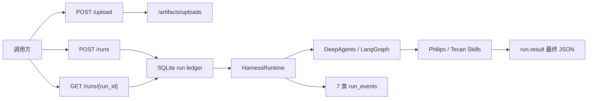

# DsAgents 系统架构

> 本轮刷新：2026-07-24。对齐 `backend/.planning/codebase/`（Analysis Date: 2026-07-24，`last_mapped_commit: 79f97d239243d0513de93f10224eef470fffd83c`）。本文只定义系统边界与稳定决策；实现细节以 codebase 事实文档为准。调用链与按任务阅读见 [coding_maps/SYSTEM_MAP.md](coding_maps/SYSTEM_MAP.md)。

## 系统定位

DsAgents 是**单子项目、run-first** 的 Agent 运行时底座：产品代码仅在 `backend/`（发行名 `dsagents`），**无前端子项目**。它接收本轮消息与上传 artifact，驱动可注入的 DeepAgents Brain，将过程投影为可轮询的 run 与固定事件，并将 Philips 外高桥 / Tecan 境外供应链的最终业务 JSON 写入 `run.result`，供 OMS 消费。



## 稳定系统边界

- HTTP 仅四端点：`POST /upload`、`POST /runs`、`GET /runs/{run_id}`、`POST /runs/{run_id}/cancel`。调用方轮询；**无** SSE、session CRUD、下载路由、Webhook 或 OMS 自动保存 API。
- **run-first**：`run` 是唯一执行与查询单位；`run_events` append-only，`runs` 为投影快照。最终业务 JSON 只读 `run.result`，不解析 `reply`、thinking 或工具候选文本。
- `session_id` 只作 LangGraph `thread_id` 与进程内同 session 单飞锁；不承担业务状态、归档或查询接口。
- 三层状态归属清晰、互不替代：
  - run ledger → 对外执行终态与可观测投影
  - LangGraph checkpointer → 短期图上下文（`thread_id=session_id`）
  - LangGraph store → Agent memory（`/memories/`）
- 代码边界固定为 `backend/api.py`、`runtime/`、`integrations/`、`skills/`；历史 setuptools 构建产物（如 `backend/build/`、`dist/`、`*.egg-info`）不是源码。
- 部署假设为**单进程** session 锁与 cancel control；多 worker 无跨进程互斥。
- 无 HTTP Auth；默认假定受信内网 / 网关鉴权。
- 程序内入口 `AgentResources` + `create_harness(...).execute_run(...)` 可绕过 HTTP；**不**写 OMS 旁路索引。

## 子系统职责

| 层 | 路径 | 职责 |
|----|------|------|
| HTTP 适配 | `backend/api.py` | 请求校验、上传、创建 run、后台 daemon 线程执行、轮询、cancel、usage 计价、OMS best-effort 写点 |
| 运行时 | `backend/runtime/` | Brain 装配、stream→事件投影、middleware、ToolCatalog、三库资源、run ledger、OMS JSONL |
| 集成 | `backend/integrations/` | `/artifacts` 路径、MinerU HTTP、JSON artifact 读写 |
| 业务 Skill | `backend/skills/` | 共享渠道合同、Philips/Tecan 下划线 Skill 包、主数据 / XLSX / finalizer |
| 本地门禁 | `backend/tests/` | 可执行 assert 脚本（`python -m tests.*`，**非 pytest**） |
| 实现事实 | `backend/.planning/codebase/` | 架构/结构/栈/集成/约定/测试/风险（Analysis Date: 2026-07-24） |

依赖单向：`api → runtime → integrations / skills`。Skill 工具可依赖 `integrations.artifacts`，不反向调用 HTTP。`typing.Protocol` **只**用于 `Brain` / `BrainFactory`；工具为 callable + `ToolCatalog`；资源与 ledger 为具体类。

### 目录职责（形状）

```text
backend/
├── api.py                 # 唯一 HTTP 入口
├── runtime/               # run-first 执行核心
│   ├── agent.py           # Brain / BrainFactory / denylist
│   ├── execution.py       # HarnessRuntime.execute_run
│   ├── middleware.py      # Recovery / Telemetry / NoProgress / Compatibility / Memory
│   ├── tools.py           # 静态五工具 ToolCatalog
│   ├── resources.py       # 三库 + CompositeBackend
│   ├── runs.py            # SqliteRunLedger
│   ├── observability.py   # 纯 chunk 抽取（无 I/O）
│   └── oms_log.py         # OMS JSONL 旁路
├── integrations/          # artifacts + MinerU
├── skills/                # channel_contract + 两渠道下划线包
└── tests/                 # assert 门禁与 opt-in 真实集成
```

权威目录树与放置新代码规则见 codebase [STRUCTURE.md](backend/.planning/codebase/STRUCTURE.md)。

### 模块入口（一页）

| 区域 | 入口 | 当前职责 |
|------|------|----------|
| 执行 | `runtime/execution.py` | `HarnessRuntime.execute_run`、stream→七类 events、结果投影、协作 cancel |
| Agent | `runtime/agent.py` | `Brain`/`BrainFactory`、`DeepAgentsBrainFactory`、WGQ ToolStrategy、denylist |
| Middleware | `runtime/middleware.py` | Philips recovery、telemetry、loop 检测、thinking 兼容、memory |
| 工具目录 | `runtime/tools.py` | 静态 **5** 工具 `ToolCatalog` |
| 资源 / 三库 | `runtime/resources.py` | `AgentResources`、`CompositeBackend`、路径锚定 `backend/` |
| ledger | `runtime/runs.py` | runs 投影 + append-only events |
| 可观测抽取 | `runtime/observability.py` | 纯函数 chunk 抽取；`MAIN_AGENT_NAME = "dsagents-main"` |
| OMS 旁路 | `runtime/oms_log.py` | `run_created` JSONL best-effort |
| 合同 | `skills/channel_contract.py` | 共享 24 字段 `OrderItem`、problems、outcome |
| Philips（WGQ） | `skills/philips_wgq_inbound_recognition/` | Skill 资源 + schema + Tracking / 共享 Oracle lookup；货代版式 `references/freight-forwarders.md` |
| Tecan（DK） | `skills/tecan_import/` | Skill 资源 + XLSX inspection + finalizer（无 Excel）；共享 12NC lookup |

## 渠道供应链业务设计

### 终态合同

- Philips 与 Tecan 的 `header` 各自独立；`items[]` 共用完整 **24** 字段，返回的每一行必须全字段出现，未知为 `null`。
- 外壳固定：`{outcome, data: {header, items}, problems}`。不输出 `shipment`、Excel、候选抽取噪声、审计细节或 OMS 保存结果。
- 数量、金额、重量为无千分位、非科学计数法字符串；日期为 `YYYY-MM-DD`；编号保留原始字符与前导零。
- `success`、`partial_success`、`input_problems` 都是有效业务 outcome。核心票次/商品事实无法确认时使用 `input_problems`，仍返回完整 header、已证实字段与可复核 problems；该 run 仍为 **`succeeded`**。
- OMS **只消费** `run.result`，不依赖 `reply`、Excel、候选工具结果或审计文本。

### 材料与证据

- 两渠道均可接收同票任意组合的 PDF/XLSX，按**内容**识别发票、运单、装箱单、订单/合同与主数据，不按文件名或固定数量猜测。
- PDF 经 MinerU，XLSX 经只读 inspection 转为 JSON artifact。ZIP、DOCX、图片不解析内容，作为待确认问题列出；其它材料足够时继续。`parse_documents` 返回 ZIP 时先 `extract_archives` 再读文本。
- 单据事实优先；主数据只按唯一明确的非语义标识补齐，不能覆盖本票数量、金额、重量或编号。冲突/舍入歧义转 `input_problems`。
- 发票上传顺序与原始行顺序必须保留；相同 12NC 默认不合并；同票多个发票/运单稳定地以英文逗号连接。
- 业务同票归集在**单一 run** 内完成；不新增跨 run 消息/任务状态表。

### 渠道路径（同票单一 run）

```text
WGQ workflow
  → /skills/philips-wgq-inbound-recognition/SKILL.md
  → references/freight-forwarders.md（DHL / DSV / FedEx / UPS / 康捷空）
  → parse_documents / inspect_supply_chain_workbooks
  → 唯一 Tracking 时 lookup_philips_wgq_master_data
  → denylist 排除 Tecan finalizer
  → PhilipsWgqRecognitionResult → run.result

DK workflow
  → /skills/tecan-import/SKILL.md + references/
  → parse_documents / inspect_supply_chain_workbooks
  → 唯一 12NC 时 lookup_philips_wgq_master_data（不传 Tracking）
  → finalize_tecan_overseas_recognition → run.result
```

## Agent、状态与 middleware 决策

本期**没有**增加业务消息状态、任务状态机或生产业务 SubAgent。

原因：同票材料只需在一次 Agent run 内归集；外部终态已由 ledger 保存，线程上下文已由 checkpointer 保存。再引入子任务候选、跨 run 工作单或额外 state schema 会让同一票事实在多个位置竞争，不能提高 OMS 合同的确定性。

middleware 只保留横切运行时能力：

| 能力 | 方式 | 原因 |
|------|------|------|
| Philips 结构化输出恢复 | class-based `after_model`（`StructuredOutputRecovery`） | 需读同回合消息、更新状态并通过 `jump_to` 重试/结束；`can_jump_to` 必须含 `"end"` |
| Tool 观测 / 无进展检测 / ToolStrategy thinking 兼容 | runtime middleware | 跨业务、跨模型的执行问题 |
| Memory | `MemoryMiddleware`（主 Agent 有 memory 时） | 加载 `/memories/AGENTS.md` |
| Tecan 最终 JSON | 专用 finalizer 工具 | 业务合同校验，不污染普通请求或全局 graph state |

主 Agent 有 memory 时约 **5** 个 middleware（Recovery 仅 WGQ）；DK/普通 run 使用 `structured_schema=None`，不按 Philips schema 恢复。生产 `subagents=[]`，并关闭默认 general-purpose subagent。

**StructuredOutputRecovery 硬约束**（WGQ 专用）：

- `can_jump_to` 必须含 `"model"` 与 **`"end"`**
- 耗尽必须显式 `jump_to: "end"`，禁止只返回 `None`
- 空 data 壳：同回合 `tool_call_id` 恢复或 skeleton；空壳耗尽 → all-null + `partial_success`（**技术兜底**，非业务模板）
- 其它失败耗尽 → 无 `structured_response` → harness `failed`

## 运行时装配

- `DeepAgentsBrainFactory` 关闭默认 general-purpose subagent，并传递 `subagents=[]`。
- 固定工具 **5** 个：`parse_documents`、`extract_archives`、`lookup_philips_wgq_master_data`（WGQ / DK 共享 12NC 主数据）、`inspect_supply_chain_workbooks`、`finalize_tecan_overseas_recognition`（静态注册，无自动扫描）。
- HTTP workflow：`WGQ` 使用 `ToolStrategy(PhilipsWgqRecognitionResult)` + Recovery，`DK` 使用 Tecan finalizer；workflow 与客户端 `session_id` 互斥（服务端强制新 session）。
- `DK` 只信任 `finalize_tecan_overseas_recognition` ToolMessage → `run.result`，缺 finalizer 终态即失败。
- WGQ 用 **denylist** 排除 Tecan finalizer；DK 当前以空 denylist 保留共享 12NC lookup 与 finalizer；两者均保留共享 MinerU / XLSX 工具，**禁止**业务-only allowlist。
- Skill **单目录**：下划线命名的可 import Python 包内同时放 `SKILL.md` / references、schema 与 scripts；运行时以同一目录的连字符 `/skills/` 别名供 Agent Skills 加载；新增须同步 `package-data` 与 skills 路由。Tecan 不携带 Excel 模板或生成器。
- Agent 虚拟 FS：`/artifacts/`、`/skills/`（写拒绝）、`/memories/`、`/large_tool_results/` + 默认 `StateBackend`。

## 存储、可观测性与运维

- 三 SQLite 物理分离：`dsagents_runs.db`（ledger）、`dsagents_checkpoints.db`、`dsagents_store.db`；无自动 schema migration；连接不共享；路径由 `ResourceConfig` 锚定 `backend/`（与 CWD 无关）。
- 事件固定 **7** 类：`status`、`tool_execution`、`tool_progress`、`thinking`、`text_delta`、`assistant_message`、`model_usage`。大 payload 可外置到 `data/internal/run-events/`（默认阈值 256KiB）。
- OMS JSONL 索引只在 HTTP `create_run` 成功后 best-effort 追加（`backend/log/oms_log.log`），不是 event、无查询接口、不阻塞 run、不含 `run.result`。程序内 `execute_run` **不**写 OMS。
- ledger 与 OMS 时间均使用 **UTC+8** 本地 `YYYY-MM-DD HH:MM:SS`。
- 出站：MiniMax（Anthropic 兼容 LLM）、MinerU HTTP、WGQ / DK 共用的可选 Oracle 主数据。Windows checkout 随仓库提供 Instant Client（`backend/.oracle/instantclient/instantclient_19_31`），并在未设置 `ORACLE_CLIENT_LIB_DIR` 时自动用于 thick mode；缺客户端或连接配置时优雅降级为 problems/null，不丢弃已证实单据事实。
- Cancel 为协作式 `RunControl` drain，**不能**强杀已发出的外部 HTTP/Oracle；启动 lifespan 将残留 `queued`/`running`/`cancelling` 标为 `failed`（不自动续跑）。

## 理解路径

| 目标 | 阅读顺序 |
|------|----------|
| 系统边界与决策 | 本文 → [INTERFACES.md](INTERFACES.md) → [coding_maps/SYSTEM_MAP.md](coding_maps/SYSTEM_MAP.md) |
| 实现细节 | [backend/.planning/codebase/](backend/.planning/codebase/)（Analysis Date: 2026-07-24） |
| 全局硬约束 | [AGENTS.md](AGENTS.md) → [docs/conventions.md](docs/conventions.md) |
| 渠道业务合同 | [docs/channel-supply-chain-json-prd.md](docs/channel-supply-chain-json-prd.md) |
| 按任务入口 | [docs/reading-order.md](docs/reading-order.md) 或 SYSTEM_MAP §6–§7 |
| 命令与门禁 | [docs/commands.md](docs/commands.md) |

## 质量门禁

在 `backend/` 使用 `uv sync`，依次运行七个 `python -m tests.*` assert 脚本；真实模型、MinerU、Oracle 与本地样本回归另行 opt-in。改 backend 后：先更新 `backend/.planning/codebase/`，再更新本文、`INTERFACES.md`、`coding_maps/SYSTEM_MAP.md`，最后在仓库根目录执行 `git diff --check`。

```powershell
cd backend
uv sync
python -m tests.test_tools
python -m tests.test_run_ledger
python -m tests.test_harness
python -m tests.test_api
python -m tests.test_workflow_setup
python -m tests.test_philips_wgq_inbound_recognition
python -m tests.test_tecan_import
```

## 维护约定

- 根级 `ARCHITECTURE.md` / `INTERFACES.md` / `AGENTS.md` 只承载边界、接口与导航；实现算法、字段级细节、测试夹具放 codebase 或 `docs/`。
- 刷新时以 `backend/.planning/codebase/` 为事实源；保留仍正确的人工硬约束，不无脑重写。
- 说明性文字用简体中文；标识符、路径、命令、配置键、API 名保留原文；不写密钥 / `.env` 值 / 私有连接串。
