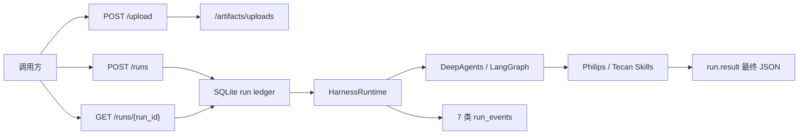

# DsAgents 系统地图

> 刷新日期：2026-07-22。用于快速定位调用链、边界与按任务阅读路径；实现细节以 `backend/.planning/codebase/` 为准，系统边界以根级 `ARCHITECTURE.md` / `INTERFACES.md` 为准。

## 1. 系统目的与仓库形态

DsAgents 是**单子项目、run-first** 的 Agent 运行时底座：接收本轮消息与上传 artifact，驱动可注入的 DeepAgents Brain，将过程投影为可轮询的 run 与固定 7 类事件，并将 Philips / Tecan 渠道的最终业务 JSON 写入 `run.result`，供 OMS 消费。

| 项 | 事实 |
|----|------|
| 发行名 | `dsagents` |
| 产品代码 | 仅 `backend/`（`api.py` + `runtime/` + `integrations/` + `skills/`） |
| 前端子项目 | **无**；无 TypeScript/Web UI 子仓 |
| 交互模式 | HTTP 轮询四端点；**无 SSE / session CRUD / 下载路由** |
| 业务 workflow | `WAG`（飞利浦外高桥）与 `DK`（帝肯境外供应链） |
| 包管理 | `uv` + `backend/uv.lock`（勿用 `pip install -e .` 绕过 lock） |



---

## 2. 子项目职责表

仓库只有 **backend** 一个产品子项目（外加根级文档与本地图）。

| 区域 | 路径 | 职责 | 详细事实 |
|------|------|------|----------|
| HTTP 适配 | `backend/api.py` | 四端点、请求校验、session 进程内单飞、后台线程执行、轮询投影、cancel、usage 计价、OMS best-effort 写点 | [INTEGRATIONS](../backend/.planning/codebase/INTEGRATIONS.md)、[STRUCTURE](../backend/.planning/codebase/STRUCTURE.md) |
| 运行时核心 | `backend/runtime/` | Brain 装配、stream→事件、middleware、ToolCatalog、三库资源、run ledger、OMS JSONL | [ARCHITECTURE](../backend/.planning/codebase/ARCHITECTURE.md) |
| 外部集成 | `backend/integrations/` | `/artifacts` 路径、MinerU HTTP、JSON artifact 读写 | [INTEGRATIONS](../backend/.planning/codebase/INTEGRATIONS.md) |
| 业务 Skill | `backend/skills/` | 渠道合同、Philips/Tecan 下划线 Skill 包（资源 + 代码）、主数据/XLSX/finalizer | [STRUCTURE](../backend/.planning/codebase/STRUCTURE.md)、[CONVENTIONS](../backend/.planning/codebase/CONVENTIONS.md) |
| 本地门禁 | `backend/tests/` | 可执行 assert 脚本（`python -m tests.*`，**非 pytest**） | [TESTING](../backend/.planning/codebase/TESTING.md) |
| 实现事实文档 | `backend/.planning/codebase/` | 架构/结构/栈/集成/约定/测试/风险（Analysis Date: 2026-07-22） | 本目录七文件 |
| 系统文档 | 仓库根 `ARCHITECTURE.md`、`INTERFACES.md`、`AGENTS.md`、`docs/*` | 边界决策、接口合同、导航与业务 PRD | 根级与 `docs/` |

### 一页总览（模块入口）

| 区域 | 入口 | 当前职责 |
|------|------|----------|
| HTTP | `backend/api.py` | 四端点、run/session 校验、后台执行、轮询、cancel、OMS 索引 |
| 执行 | `backend/runtime/execution.py` | `HarnessRuntime.execute_run`、stream→七类 events、结果投影 |
| Agent | `backend/runtime/agent.py` | `DeepAgentsBrainFactory`、Philips ToolStrategy、denylist、关闭默认子代理 |
| Middleware | `backend/runtime/middleware.py` | Philips recovery、telemetry、loop 检测、thinking 兼容、memory |
| 工具目录 | `backend/runtime/tools.py` | 静态 **5** 工具 `ToolCatalog` |
| 业务合同 | `backend/skills/channel_contract.py` | 共享 24 字段 `OrderItem`、problems、outcome |
| Philips（WAG） | `skills/philips_wgq_inbound_recognition/` | workflow、Skill、schema、Tracking/Oracle lookup |
| Tecan（DK） | `skills/tecan_import/` | workflow、Skill/references、XLSX inspection、最终 JSON finalizer |
| 持久化 | `runtime/runs.py` / `resources.py` | run ledger、checkpointer、store 三 SQLite |

依赖方向（单向）：`api → runtime → integrations / skills`。Skill 工具可依赖 `integrations.artifacts`，不反向调用 HTTP。

---

## 3. 调用链与数据流

### 3.1 HTTP → run → result

```text
POST /upload
  → data/artifacts/uploads/<stem>_<timestamp>.<ext>
  → 响应 file_path = /artifacts/uploads/...

POST /runs {workflow?, session_id?, messages[]}
  → api.py 校验 RunRequest（extra=forbid）
  → 进程内 session 单飞锁（冲突 → 409）
  → SqliteRunLedger.create_run(status=queued) + status 事件
  → OMS JSONL best-effort（失败不阻塞）
  → threading.Thread(daemon) → HarnessRuntime.execute_run
      → emit status=running
      → BrainFactory.create(middleware, tools, workflow)
      → brain.stream(messages, thread_id=session_id, control=RunControl)
      → messages/custom/updates → 7 类 run_events
      → Philips structured_response 或 Tecan finalizer → run.result
      → status=succeeded | failed | cancelled
  → finally 释放 session 锁

GET /runs/{run_id}?after_event_id=
  → {run, workflow, result, events, latest_content_event, usage}

POST /runs/{run_id}/cancel
  → cancelling + RunControl drain（协作式，不强杀外部 HTTP/Oracle）
```

状态机：

```text
queued → running → succeeded | failed | cancelled
queued → cancelled
running → cancelling → cancelled
```

启动 lifespan：`fail_incomplete_runs("执行已中断，请重试")` 清理残留 `queued` / `running` / `cancelling`。

### 3.2 stream → 事件投影

`stream_mode=["messages", "custom", "updates"]`，`version="v2"`：

| stream kind | 产出 |
|-------------|------|
| `messages` | `model_usage`、`thinking`、`text_delta`（主 Agent；subagent 文本过滤、usage 仍记账） |
| `custom` | `tool_progress`（MinerU/解压）或 `tool_execution`（ToolTelemetry 等） |
| `updates` | `tool_execution`（tool_calls）、`assistant_message`；捕获 Philips `structured_response` 与 Tecan finalizer ToolMessage |

### 3.3 终态业务结果路径

| 路径 | 触发 | 投影 | 缺结果时 |
|------|------|------|----------|
| WAG（Philips） | `workflow=WAG` | `ToolStrategy` → `structured_response` → `PhilipsWgqRecognitionResult` → `run.result` | run `failed` |
| DK（Tecan） | `workflow=DK` | `finalize_tecan_overseas_recognition` ToolMessage → `TecanOverseasRecognitionResult` → `run.result` | run `failed` |
| 通用 Tecan 请求 | 无 workflow + 明确 Skill 请求 | 同一 finalizer 路径 | 可 `succeeded` 且 `result=null`（普通阅读合法） |
| 普通阅读 | 无 workflow、无 finalizer | `result` 可为 `null` | 仍 `succeeded` |

`run.result` 是 OMS 消费的**唯一**业务通道；`reply` 仅为自然语言摘要。`input_problems` 是合法业务 outcome，run 仍为 `succeeded`。

### 3.4 渠道路径（同票单一 run）

```text
WAG workflow
  → /skills/philips_wgq_inbound_recognition/SKILL.md
  → references/freight-forwarders.md（DHL / DSV / FedEx / UPS / 康捷空）
  → parse_documents / inspect_supply_chain_workbooks
  → 唯一 Tracking 时 lookup_philips_wgq_master_data
  → denylist 排除 Tecan finalizer
  → PhilipsWgqRecognitionResult → run.result

DK workflow
  → /skills/tecan_import/SKILL.md + references/
  → parse_documents / inspect_supply_chain_workbooks
  → 同票归集与字段裁决
  → finalize_tecan_overseas_recognition → run.result
```

两渠道 `header` 独立，`items[]` 共用完整 **24** 字段；不输出 `shipment`、Excel、候选噪声。无跨 run 业务状态表、无生产业务 SubAgent。

### 3.5 Agent 装配

```text
AgentResources
  ├─ CompositeBackend（/artifacts /skills /memories /large_tool_results + StateBackend）
  ├─ checkpointer（thread_id=session_id → dsagents_checkpoints.db）
  ├─ store（/memories/ → dsagents_store.db）
  └─ runs（dsagents_runs.db + 大事件外置）

DeepAgentsBrainFactory
  ├─ general-purpose subagent disabled；subagents=[]
  ├─ static ToolCatalog（5）
  ├─ WAG: ToolStrategy + WAG_WORKFLOW_PROMPT + denylist
  ├─ DK: DK_WORKFLOW_PROMPT + finalizer + denylist
  └─ generic: Skill-driven，structured_schema=None
```

### 3.6 Middleware 顺序

| 顺序 | middleware | 适用范围 |
|------|------------|----------|
| 0 | `StructuredOutputRecovery` | 仅 WAG（`structured_schema` 非空）；`after_model` + `jump_to` |
| 1 | `ToolTelemetry` | 所有 Agent |
| 2 | `NoProgressMiddleware` | 所有 Agent（同参连续 3 次 → `NoProgressLoop` → failed） |
| 3 | `StructuredOutputCompatibility` | 所有；仅 ToolStrategy 时关 thinking |
| 4 | `MemoryMiddleware` | 有 memory 的主 Agent（约 5 个 middleware） |

**StructuredOutputRecovery 硬约束**（详见 [CONVENTIONS](../backend/.planning/codebase/CONVENTIONS.md) / [CONCERNS](../backend/.planning/codebase/CONCERNS.md)）：

- `can_jump_to` 必须含 `"model"` 与 **`"end"`**
- 耗尽必须显式 `jump_to: "end"`，禁止只返回 `None`
- 空 data 壳：同回合 `tool_call_id` 恢复或 skeleton；空壳耗尽 → all-null + `partial_success`
- 其它失败耗尽 → 无 `structured_response` → harness `failed`
- DK / 普通 run 不走此路径

### 3.7 工具地图

| 工具 | 归属 | 作用 |
|------|------|------|
| `parse_documents` | MinerU | 解析 PDF 等 → downloads JSON/ZIP |
| `extract_archives` | 本地 | ZIP artifact 解压 |
| `lookup_philips_wgq_master_data` | Philips | Tracking XLSX + 可选 Oracle 唯一补齐 |
| `inspect_supply_chain_workbooks` | Tecan 包（共享） | 只读 XLSX → JSON artifact |
| `finalize_tecan_overseas_recognition` | Tecan | Pydantic 校验并返回终态 JSON 字符串 |

WAG workflow **denylist** 排除 `finalize_tecan_overseas_recognition`，保留共享 MinerU / XLSX / Philips lookup；DK workflow 排除 `lookup_philips_wgq_master_data`，保留共享工具与 Tecan finalizer。**禁止**业务-only allowlist。Tecan 不输出 Excel；`openpyxl` 只读用户材料。

---

## 4. 接口边界（HTTP / run / result）

完整请求/响应字段见根级 [INTERFACES.md](../INTERFACES.md)。

| 端点 | 要点 |
|------|------|
| `POST /upload` | multipart `files` → `{files:[{file_path,name,mime_type,size}]}`；路径形如 `/artifacts/uploads/...` |
| `POST /runs` | `{workflow?, session_id?, messages[]}` → `{run_id, session_id, status:"queued"}`；后台执行 |
| `GET /runs/{run_id}` | 可选 `after_event_id`；返回 `run` 快照、顶层 `result`（= `run.result`）、`events`、`latest_content_event`、`usage` |
| `POST /runs/{run_id}/cancel` | 协作 cancel；终态再 cancel → 409；未知 → 404 |

约束摘要：

- `messages[]`：`{role, content:[{type:"text",text}|{type:"artifact",path}]}`，`extra="forbid"`；旧 `{message:"..."}` 不支持
- `workflow` 仅允许 `WAG`、`DK` 或省略；与客户端 `session_id` **互斥**（workflow 强制服务端新 session）
- 无 Auth 中间件、无 Webhook、无 OMS 远程推送；程序内入口不写 OMS 索引

### 渠道最终 JSON 形状

```json
{
  "outcome": "success | partial_success | input_problems",
  "data": {"header": {}, "items": []},
  "problems": [{"source": "", "location": "", "issue": "", "action": ""}]
}
```

| outcome | run.status |
|---------|------------|
| `success` / `partial_success` / `input_problems` | `succeeded` |
| 缺 Philips structured_response / 运行时异常 / NoProgress | `failed` |
| 用户 cancel + GraphDrained | `cancelled` |

---

## 5. 共享状态、存储、事件、上传、产物、provider

### 5.1 状态归属（不要混用）

| 层 | 职责 | 非职责 |
|----|------|--------|
| `runs` + `run_events` | 对外执行终态与可观测投影 | 不存业务中间候选表 |
| LangGraph checkpointer | 短期图上下文（`thread_id=session_id`） | 不是 OMS 合同源 |
| LangGraph store | `/memories/` 手册与跨 run 记忆 | 不是 run 查询 API |
| `session_id` | thread_id + 进程内单飞 | 无 CRUD、非业务归档资源 |
| OMS JSONL | 运维旁路 `run_created` 索引 | 非第 8 类 event、无查询 API、不含 `run.result` |

### 5.2 三 SQLite（物理分离）

| 库 | 默认路径 | 用途 |
|----|----------|------|
| Run ledger | `backend/data/dsagents_runs.db` | runs 快照 + append-only events；大 payload → `data/internal/run-events/` |
| Checkpoints | `backend/data/dsagents_checkpoints.db` | `SqliteSaver` |
| Store | `backend/data/dsagents_store.db` | `SqliteStore`，namespace `("dsagents",)` |

时间戳：ledger 与 OMS 统一 **UTC+8** `YYYY-MM-DD HH:MM:SS`。无自动 schema migration。

### 5.3 固定 7 类事件

`status` · `tool_execution` · `tool_progress` · `thinking` · `text_delta` · `assistant_message` · `model_usage`

`latest_content_event` 排除 `status` 与 `model_usage`。

### 5.4 Artifacts

- 根：`backend/data/artifacts/`（uploads / downloads）
- 跨层唯一虚拟路径：`/artifacts/...`（禁止 `..`；MinerU 解析侧 `allow_local=True` 为例外，见风险）
- Agent 视图：`FilesystemBackend` 挂 `/artifacts/` 与 `/large_tool_results/`；`/skills/**` 写拒绝

### 5.5 Provider / 出站边界

| 集成 | 入口 | 失败策略 |
|------|------|----------|
| MiniMax（Anthropic 兼容） | `DeepAgentsBrainFactory`；`MINIMAX_*` | 模型/流异常 → run `failed` |
| MinerU | `integrations/mineru.py`；`MINERU_*` | 工具异常/超时；可投影 progress |
| Oracle（可选） | Philips lookup；`ORACLE_*` + 可选 `ORACLE_CLIENT_LIB_DIR` | problems + null 字段，不拖垮已证实结果 |
| OMS JSONL | `runtime/oms_log.py` → `backend/log/oms_log.log` | best-effort，`except: pass` |

无第二生产 LLM 接线；无 Auth / Webhooks。详见 [INTEGRATIONS](../backend/.planning/codebase/INTEGRATIONS.md)。

### 5.6 程序内入口

```python
with AgentResources(...) as resources:
    harness = create_harness(resources)
    for event in harness.execute_run(messages, session_id, run_id, workflow=None):
        ...
```

---

## 6. 依赖与归属规则

| 规则 | 说明 |
|------|------|
| Protocol 仅 Brain | `typing.Protocol` **只**用于 `Brain` / `BrainFactory`；工具 = callable + `ToolCatalog`；资源/ledger = 具体类 |
| 工具静态注册 | `default_tool_catalog()` 五行；禁止目录扫描；新增须改 catalog + package-data |
| workflow 收窄 = denylist | WAG 排除 Tecan finalizer，DK 排除 Philips lookup；禁止业务-only allowlist |
| Skill 单目录 | 下划线命名的可 import Python 包内含 `SKILL.md`/references、schema、scripts；更新 `pyproject.toml` package-data |
| 终态只写 `run.result` | 不从 `reply`/thinking/工具候选/Excel 推断 OMS 数据 |
| 同票单一 run | 不新增消息/任务状态表或业务 middleware |
| 横切 vs 业务校验 | Philips recovery 用 middleware；Tecan 用 finalizer 工具，不污染普通 run 的 schema |
| 源码权威 | `api.py` + `runtime/` + `integrations/` + `skills/`；**勿**把 `backend/build/` 等构建产物当源码 |
| 文档同步 | 改 backend → 先 `backend/.planning/codebase/` → 再根级架构/接口/本地图 → `git diff --check` |
| 部署假设 | session 锁与 `run_controls` **进程内**；多 worker 无跨进程互斥/cancel |

分层放置新代码：见 [STRUCTURE — 放置新代码](../backend/.planning/codebase/STRUCTURE.md)。

---

## 7. 按任务分类的阅读指南

> **无前端子项目**：所有产品改动落在 `backend/`；UI/页面类需求不适用本仓。

### 7.1 backend 业务（Philips / Tecan / 合同）

1. [docs/channel-supply-chain-json-prd.md](../docs/channel-supply-chain-json-prd.md)（业务合同）
2. 本文 §3.4 / §3.7 与 [INTERFACES.md](../INTERFACES.md) 渠道 JSON 节
3. `backend/skills/channel_contract.py`
4. Philips：`skills/philips_wgq_inbound_recognition/SKILL.md`、`schema.py`、`scripts/tools.py`
5. Tecan：`skills/tecan_import/SKILL.md` + `references/`、`schema.py`、`scripts/tools.py`
6. 事实补充：[ARCHITECTURE](../backend/.planning/codebase/ARCHITECTURE.md) 渠道合同节、[CONVENTIONS](../backend/.planning/codebase/CONVENTIONS.md)

### 7.2 backend API / HTTP

1. [INTERFACES.md](../INTERFACES.md)
2. `backend/api.py`
3. [INTEGRATIONS](../backend/.planning/codebase/INTEGRATIONS.md) HTTP 表面
4. 验证：`python -m tests.test_api`

### 7.3 存储 / ledger / 事件

1. 本文 §5
2. `backend/runtime/runs.py`、`resources.py`、`oms_log.py`
3. [ARCHITECTURE](../backend/.planning/codebase/ARCHITECTURE.md) 执行数据流 + 七类事件
4. 验证：`python -m tests.test_run_ledger`

### 7.4 runtime / Brain / middleware / 工具

1. `backend/runtime/agent.py`、`execution.py`、`middleware.py`、`tools.py`
2. [ARCHITECTURE](../backend/.planning/codebase/ARCHITECTURE.md) Agent/middleware/工具表
3. [CONVENTIONS](../backend/.planning/codebase/CONVENTIONS.md) Recovery 与 denylist
4. [CONCERNS](../backend/.planning/codebase/CONCERNS.md) Recovery / denylist 脆弱点
5. 验证：`test_harness`、`test_workflow_setup`、`test_tools`

### 7.5 跨系统接口（MinerU / Oracle / LLM / OMS / artifacts）

1. [INTEGRATIONS](../backend/.planning/codebase/INTEGRATIONS.md)
2. [STACK](../backend/.planning/codebase/STACK.md) 环境变量表
3. `integrations/mineru.py`、`integrations/artifacts.py`、Philips Oracle 工具
4. 风险：[CONCERNS](../backend/.planning/codebase/CONCERNS.md)

### 7.6 领域流程（渠道供应链）

1. 根级 [ARCHITECTURE.md](../ARCHITECTURE.md)「渠道供应链业务设计」
2. 本文 §3.4
3. Skill 资源 + schema + PRD
4. 真实样例：opt-in `tests.test_real_*`（非默认门禁）

### 7.7 文档与导航

1. [AGENTS.md](../AGENTS.md)（全局硬约束入口）
2. [docs/reading-order.md](../docs/reading-order.md)、[docs/conventions.md](../docs/conventions.md)、[docs/commands.md](../docs/commands.md)
3. [docs/backend.md](../docs/backend.md)、[docs/project-overview.md](../docs/project-overview.md)
4. 改文档后：`git diff --check`

### 7.8 新增 Skill 检查顺序

1. 单一下划线 Skill 包（`SKILL.md` / references / schema / scripts）
2. `runtime/tools.py` 静态注册
3. WAG / DK denylist 是否需排除**其他业务**新工具
4. `pyproject.toml` package-data
5. tests + codebase 事实 + 本地图/INTERFACES（若 HTTP 边界变）

---

## 8. 集成风险检查清单与验证入口

### 8.1 改动前速查

| 主题 | 必守 | 验证 |
|------|------|------|
| Recovery / ToolStrategy | `can_jump_to` 含 `end`；耗尽显式 `jump_to`；空壳 `tool_call_id` | `python -m tests.test_harness` |
| 工具表 / denylist | 仍只 denylist 其他业务工具；禁止 allowlist | `test_tools` + `test_workflow_setup` |
| HTTP / 锁 / cancel | 不引入 SSE/session API；单进程锁语义 | `test_api` + `test_run_ledger` |
| 渠道 JSON 24 字段 | 同步 `channel_contract`、两 schema、Skill、recovery skeleton、两侧测试 | Philips + Tecan 测试模块 |
| Oracle / MinerU / 路径 | 优雅降级；密钥不进文档；注意 `artifacts_root` 与 `ResourceConfig` 对齐 | [CONCERNS](../backend/.planning/codebase/CONCERNS.md)、`test_tools` |
| OMS | best-effort；失败不阻塞 queued | `test_api` |
| 多 worker | 当前**不**支持跨进程 session 互斥与 cancel | 部署单 worker 假设 |

### 8.2 其它已知风险（摘要）

- Cancel 不能强杀已发出的 MinerU/Oracle 调用；可能长时间 `cancelling`
- DK 未调 finalizer 时 `failed`；通用 Tecan 请求未调 finalizer 时仍可能 `succeeded` + `result=null`，客户端必须检查 `result`
- 空壳 all-null 是 **runtime 技术兜底**，不是业务 partial 模板
- 上传无配额、HTTP 无鉴权 → 依赖内网/网关
- daemon 线程 + 启动 `fail_incomplete_runs`：崩溃 run 不自动续跑

完整列表见 [CONCERNS](../backend/.planning/codebase/CONCERNS.md)。

### 8.3 本地验证入口

```powershell
cd backend
uv sync
python -m tests.test_tools
python -m tests.test_run_ledger
python -m tests.test_harness
python -m tests.test_api
python -m tests.test_workflow_setup
python -m tests.test_philips_wgq_inbound_recognition
python -m tests.test_tecan_import
# 仓库根目录
git diff --check
```

真实模型 / MinerU / Oracle / 外部 HTTP：opt-in `tests.test_real_*` 与 [TESTING](../backend/.planning/codebase/TESTING.md) / [docs/commands.md](../docs/commands.md)。

启动服务（运维）：

```powershell
cd backend
uv run uvicorn api:app --host 0.0.0.0 --port 8500
```

---

## 9. 使用过的源文档索引

本轮刷新（2026-07-22）对齐并引用下列源（路径相对仓库根）：

| 优先级 | 路径 |
|--------|------|
| 1 | `AGENTS.md` |
| 2 | `ARCHITECTURE.md` |
| 3 | `INTERFACES.md` |
| 4 | `backend/.planning/codebase/ARCHITECTURE.md` |
| 4 | `backend/.planning/codebase/STRUCTURE.md` |
| 4 | `backend/.planning/codebase/STACK.md` |
| 4 | `backend/.planning/codebase/INTEGRATIONS.md` |
| 4 | `backend/.planning/codebase/CONVENTIONS.md` |
| 4 | `backend/.planning/codebase/TESTING.md` |
| 4 | `backend/.planning/codebase/CONCERNS.md` |
| 5 | `coding_maps/SYSTEM_MAP.md`（上一版，保留仍正确的结构与表述后覆盖刷新） |

相关但不作为本轮逐字源的导航文档：`docs/conventions.md`、`docs/commands.md`、`docs/reading-order.md`、`docs/channel-supply-chain-json-prd.md`、`docs/backend.md`、`docs/project-overview.md`。
